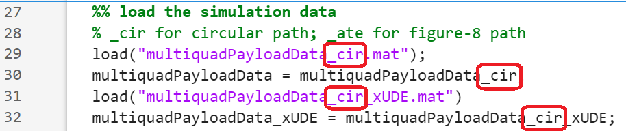
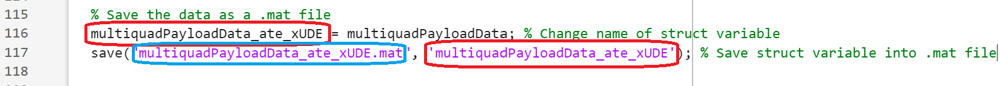

# A Robust Neural Control Design for Multi-drone Slung Payload Manipulation with Control Contraction Metrics
Pytorch and Matlab implementation of the ACC2026 paper "Neural Robust Control for Multi-drone Slung Payload Manipulation with Control Contraction Metrics", by Xinyuan Liang, Longhao Qian, Yi Lok Lo and Hugh H.T. Liu

## Acknowledgement
The codes are developed based on the CoRL'20 paper "[Learning Certified Control Using Contraction Metric](https://arxiv.org/abs/2011.12569)", by Dawei Sun, Susmit Jha, and Chuchu Fan.

## Supplementary documents
The derivation of our system dynamics can be found [in this document](Support_document.pdf).

## Requirements
Dependencies include ```torch```, ```tqdm```, ```numpy```, and ```matplotlib```. You can install them using the following command.
```bash
pip install -r requirements.txt
```

## Dual training of CCM and controller
The script ```main.py``` can be used for learning the controller.

Below is a list of configuration variables and hyperparameters that can be tuned in main.py:

| Hyperparameters | Meaning |
| ------------- | ------------- |
| bs | Batch size |
| num_train | Number of training samples |
| num_test | Number of testing samples |
| learning_rate| Base learning rate |
| epochs | Number of training epochs |
| lr_step | Number of epochs for each learning rate |
| _lambda | Convergence rate |
| w_ub | Upper bound for dual metric |
| w_lb | Lower bound for dual metric |

| Configuration variables | Meaning |
| ------------- | ------------- |
| task | Name of the system |
| log | Directory name for storing the training log |
| use_cuda | Enable/disable CUDA |

Run the following command to learn a controller for the 3-drone slung payload system.
```
python3 main.py
```
The neural network model satisfying the contracting conditions with the best accuracy will be saved in [[log_name]/model_best.pth.tar](log_MUAV_point_mass_constrained/model_best.pth.tar) and the corresponding learned feedback controller function will be saved in [[log_name]/controller_best.pth.tar](log_MUAV_point_mass_constrained/controller_best.pth.tar). 

## Simulation of closed-loop system
The script ```plot.py``` can be used for simulating the closed-loop system under the learned controller. 

Below is a list of variables to create the desired plot in plot.py:

| Simulation variables | Meaning |
| ------------- | ------------- |
| trajectory_type | 'hover', 'circular' or 'figure-8' |
| plot_type | '2D', '3D', 'time', 'error' or 'control' |
| plot_dims | States to be plotted |
| nTraj | Number of randomly initialized trajectories to simulate |
| disturbance_switch | Enable/disable constant disturbance force |
| sigma | Bound of Stochastic disturbance force added if disturbance is enabled |
| UDE_switch | Enable/disable UDE | 
| attitude_tracking_switch | Enable/disable attitude dynamics of quadrotors |

| Configuration variables | Meaning |
| ------------- | ------------- |
| task | Name of the system |
| pretrained | Directory storing pretrained data |
| save_plot_path | Path to save the plot image |
| save_csv_path | Path to save the CSV files |

Run the following command to evaluate the learned controller and plot the results.
```
python3 plot.py
```

This runs a closed-loop simulation with the learned feedback controller stored in the training log using an RK4 solver. The UDE can be turned on/off to compare the performance of the controller. Plots are saved in [results/plots](results/plots) and CSV files are saved in [results/csvs](results/csvs) by default. Three CSV files will be produced per simulated trajectory, namely con_[i].csv, sim_[i].csv and ude[i].csv, [i] being the i<sup>th</sup> trajectory. 

## Matlab visualisation and plots
To visualize the trajectories and create plots used in our paper, the [Matlab Flight Simulation Animation Package](https://github.com/LonghaoQian/AnimationModels/tree/main) developed by Dr Longhao Qian is utilised. 

Open examples/quadrotor_slung_payload_model/quadrotorPayload.m and run ```quadrotorPayload.m``` in MATLAB. A 3D plot with drone figures will be shown in Figure 1. The UDE performance plot will be shown in Figure 2.

To get plots for circular or figure-8 trajectories in our supplementary documents, change the struct variable name to multiquadPayloadData_cir or multiquadPayloadData_ate respectively in the four lines shown in the figure below:  


To visualize simulation of your own, the CSV files generated in [results/csvs](results/csvs) need to be stored in [AnimationModels-main/examples/quadrotor_slung_payload_model](AnimationModels-main/examples/quadrotor_slung_payload_model). 

Then, save the CSV files of one trajectory as .mat files by running ```save_files.m```. 
Change the struct variable name and the name of .mat files in the save_files.m according to the figure below:


Open examples/quadrotor_slung_payload_model/quadrotorPayload.m and set the corresponding struct variable from the .mat file in quadrotorpayload.m according to the image below:


Finally, run ```quadrotorPayload.m```.

For further instruction on other visualisations, please refer to the [README file in the visualization package](AnimationModels-main/README.md).
